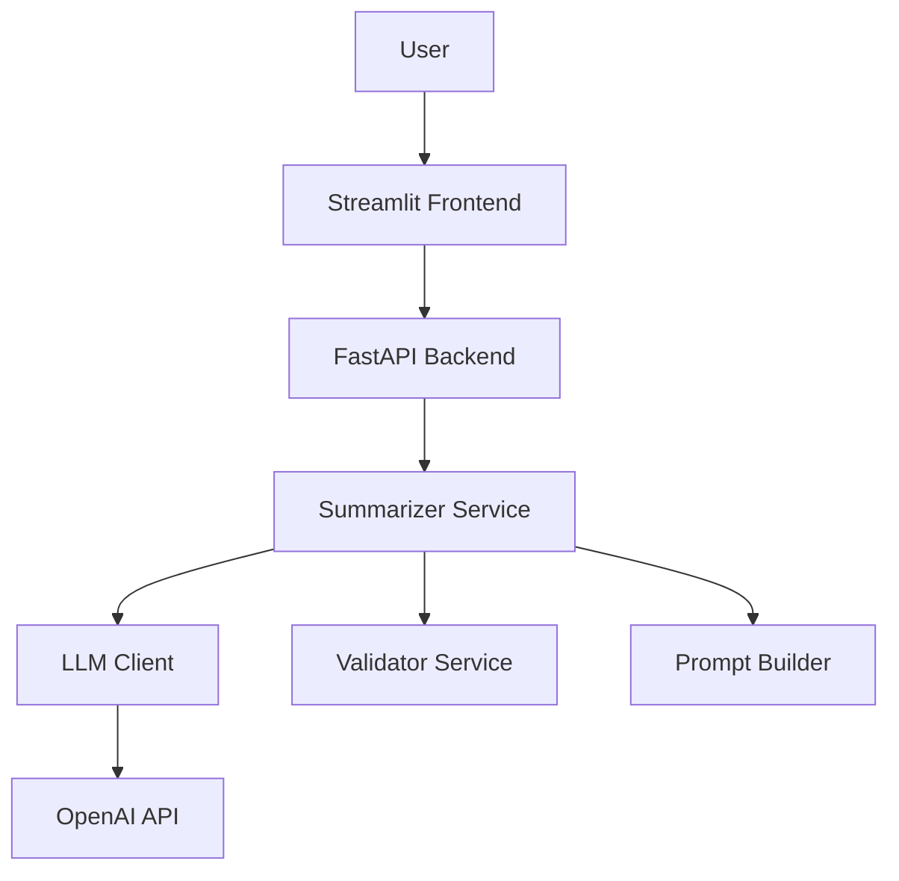

# Design Document: Loan Summarizer

## Overview

The Loan Summarizer is a production-style web application that leverages Large Language Models to analyze loan agreements and extract structured financial data while generating plain-language summaries. The system follows a modular, layered architecture with clear separation of concerns between the API layer (FastAPI), business logic (services), LLM integration (llm module), and presentation layer (Streamlit).

The application accepts loan agreement text through a web interface, processes it using OpenAI's API with structured output constraints, validates the extracted data, and returns both machine-readable JSON and human-readable summaries in the user's chosen language.

## Architecture

### High-Level Architecture



### Layer Responsibilities

**Presentation Layer (frontend.py)**
- Streamlit-based user interface
- Contract text input collection
- Language selection dropdown
- Result display (structured data + summary)
- Error message presentation

**API Layer (app.py)**
- FastAPI application setup and configuration
- Endpoint definition and routing
- Request/response validation using Pydantic
- Error handling and HTTP status code management
- CORS configuration if needed

**Service Layer (services/)**
- `summarizer.py`: Orchestrates the contract analysis workflow
- `validator.py`: Validates extracted financial data for consistency and format

**LLM Integration Layer (llm/)**
- `llm_client.py`: Manages OpenAI API communication with async operations
- `prompt_builder.py`: Constructs prompts with JSON schema constraints
- `schema.py`: Defines Pydantic models and JSON schemas for structured extraction

**Utility Layer (utils/)**
- `text_utils.py`: Text preprocessing and formatting utilities

### Technology Stack

- **Backend Framework**: FastAPI (async-capable, automatic OpenAPI docs)
- **Frontend Framework**: Streamlit (rapid UI development)
- **LLM Provider**: OpenAI API (GPT-4 or GPT-3.5-turbo)
- **Validation**: Pydantic v2 (data validation and serialization)
- **Server**: Uvicorn (ASGI server for FastAPI)
- **Python Version**: 3.11+

## Components and Interfaces

### API Endpoints

**POST /summarize**

Request Schema:
```python
class SummarizeRequest(BaseModel):
    contract_text: str = Field(..., min_length=1, description="The loan agreement text")
    target_language: Literal["English", "Hindi"] = Field(default="English")
```

Response Schema:
```python
class SummarizeResponse(BaseModel):
    structured_data: StructuredLoanData
    summary: str
    language: str
```

**GET /health**

Simple health check endpoint returning status.

### Data Models

**StructuredLoanData**
```python
class StructuredLoanData(BaseModel):
    loan_amount: Optional[str] = None
    interest_rate: Optional[str] = None
    repayment_schedule: Optional[str] = None
    total_cost_of_credit: Optional[str] = None
    late_fees: Optional[str] = None
    default_consequences: Optional[str] = None
    summary_text: str
    confidence_score: int = Field(..., ge=0, le=100)
```

### LLM Client Interface

```python
class LLMClient:
    async def generate_structured_output(
        self,
        prompt: str,
        schema: dict,
        temperature: float = 0.1
    ) -> dict:
        """
        Sends prompt to OpenAI API with JSON schema constraint.
        Returns structured JSON response.
        """
```

### Summarizer Service Interface

```python
class SummarizerService:
    async def summarize_contract(
        self,
        contract_text: str,
        target_language: str
    ) -> SummarizeResponse:
        """
        Orchestrates contract analysis:
        1. Build prompt with schema
        2. Call LLM client
        3. Validate extracted data
        4. Return structured response
        """
```

### Validator Service Interface

```python
class ValidatorService:
    def validate_financial_data(
        self,
        data: StructuredLoanData
    ) -> ValidationResult:
        """
        Validates extracted financial data:
        - Checks numerical format
        - Verifies percentage values
        - Flags inconsistencies
        """
```

### Prompt Builder Interface

```python
class PromptBuilder:
    def build_extraction_prompt(
        self,
        contract_text: str,
        target_language: str,
        schema: dict
    ) -> str:
        """
        Constructs prompt for LLM with:
        - Contract text
        - Extraction instructions
        - JSON schema specification
        - Language requirements
        """
```

## Data Models

### Request/Response Flow

1. **User Input** → Frontend collects contract_text and target_language
2. **API Request** → Frontend sends POST to /summarize with SummarizeRequest
3. **Processing** → Backend calls SummarizerService
4. **LLM Interaction** → Service builds prompt and calls LLM_Client
5. **Validation** → Service validates extracted data
6. **Response** → Backend returns SummarizeResponse
7. **Display** → Frontend renders structured data and summary

### JSON Schema for LLM Output

The system will define a strict JSON schema to constrain LLM output:

```json
{
  "type": "object",
  "properties": {
    "loan_amount": {"type": "string"},
    "interest_rate": {"type": "string"},
    "repayment_schedule": {"type": "string"},
    "total_cost_of_credit": {"type": "string"},
    "late_fees": {"type": "string"},
    "default_consequences": {"type": "string"},
    "summary_text": {"type": "string"},
    "confidence_score": {"type": "integer", "minimum": 0, "maximum": 100}
  },
  "required": ["summary_text", "confidence_score"]
}
```

### Environment Configuration

```python
class Settings(BaseModel):
    openai_api_key: str = Field(..., env="OPENAI_API_KEY")
    openai_model: str = Field(default="gpt-4-turbo-preview")
    api_timeout: int = Field(default=60)
    max_tokens: int = Field(default=2000)
```

## Correctness Properties

*A property is a characteristic or behavior that should hold true across all valid executions of a system—essentially, a formal statement about what the system should do. Properties serve as the bridge between human-readable specifications and machine-verifiable correctness guarantees.*


### Property 1: Request Validation Consistency

*For any* request body sent to the /summarize endpoint, if the request is invalid according to the Pydantic schema, the backend should return a 422 status code with validation error details.

**Validates: Requirements 2.3**

### Property 2: Response Structure Completeness

*For any* valid summarization request that completes successfully, the response should contain all three required fields: structured_data, summary, and language.

**Validates: Requirements 2.5**

### Property 3: Financial Data Extraction Completeness

*For any* loan contract text that contains identifiable financial terms (loan_amount, interest_rate, repayment_schedule, total_cost_of_credit, late_fees, default_consequences), the Summarizer should attempt to extract each present term and include it in the structured output.

**Validates: Requirements 3.1, 3.2, 3.3, 3.4, 3.5, 3.6**

### Property 4: JSON Output Format Strictness

*For any* extraction result from the Summarizer, the output should be valid JSON that can be parsed without errors and should not contain additional commentary outside the JSON structure.

**Validates: Requirements 3.7**

### Property 5: Confidence Score Range

*For any* extraction result, the confidence_score field should be an integer between 0 and 100 (inclusive).

**Validates: Requirements 3.8**

### Property 6: Language Output Matching

*For any* summarization request with a specified target_language, the generated summary_text should be in the requested language (English or Hindi).

**Validates: Requirements 4.2, 4.3**

### Property 7: Numerical Validation Consistency

*For any* extracted financial data containing numerical fields (loan_amount, interest_rate, total_cost_of_credit, late_fees), the Validator should verify that loan_amount is a positive value and interest_rate is a valid percentage, flagging any violations.

**Validates: Requirements 5.1, 5.4, 5.5**

### Property 8: Validation Result Completeness

*For any* extracted data passed to the Validator, the Validator should return a validation result object indicating data quality and any detected issues.

**Validates: Requirements 5.3**

### Property 9: Inconsistency Detection

*For any* extracted data with known inconsistencies (e.g., negative loan amounts, invalid percentage formats), the Validator should flag these issues in the validation results.

**Validates: Requirements 5.2**

### Property 10: LLM Error Handling

*For any* API error received from OpenAI (connection failure, rate limiting, invalid response), the LLM_Client should handle the error gracefully and return an appropriate error message without crashing.

**Validates: Requirements 6.4**

### Property 11: Schema Inclusion in Prompts

*For any* prompt sent to the OpenAI API by the LLM_Client, the prompt should include the JSON schema specification to enforce structured output.

**Validates: Requirements 6.5**

### Property 12: Error Response Format

*For any* error encountered during backend processing, the response should be in JSON format with error details and include an appropriate HTTP status code (4xx for client errors, 5xx for server errors).

**Validates: Requirements 9.1, 9.2**

### Property 13: Frontend Error Display

*For any* error response received by the Frontend from the Backend, the Frontend should display the error message to the user in a visible manner.

**Validates: Requirements 9.3**

### Property 14: Text Input Acceptance

*For any* text input of reasonable length (up to a defined maximum), the Frontend text area should accept and store the input without truncation or rejection.

**Validates: Requirements 1.4**

## Error Handling

### Error Categories

**1. Input Validation Errors (HTTP 422)**
- Empty contract text
- Invalid target language
- Malformed request body
- Missing required fields

**2. Authentication Errors (HTTP 401)**
- Missing OPENAI_API_KEY
- Invalid API key

**3. External Service Errors (HTTP 502/503)**
- OpenAI API connection failure
- OpenAI API timeout
- Rate limiting from OpenAI

**4. Processing Errors (HTTP 500)**
- JSON parsing failures
- Unexpected exceptions during summarization
- Validation failures

### Error Response Format

All errors return a consistent JSON structure:

```python
class ErrorResponse(BaseModel):
    error: str
    detail: str
    status_code: int
```

### Error Handling Strategy

**LLM Client Layer**
- Wrap all OpenAI API calls in try-except blocks
- Catch specific exceptions: `openai.APIError`, `openai.RateLimitError`, `openai.APIConnectionError`
- Return structured error information to calling service
- Log all errors with appropriate severity levels

**Service Layer**
- Validate inputs before processing
- Handle errors from LLM client gracefully
- Provide meaningful error messages for debugging
- Never expose internal implementation details in error messages

**API Layer**
- Use FastAPI exception handlers for consistent error responses
- Map internal exceptions to appropriate HTTP status codes
- Include request IDs for error tracking
- Return user-friendly error messages

**Frontend Layer**
- Display error messages in a dedicated error section
- Provide actionable guidance when possible (e.g., "Please enter contract text")
- Clear errors when user retries
- Log errors to console for debugging

### Retry Logic

- LLM Client implements exponential backoff for rate limit errors
- Maximum 3 retry attempts for transient failures
- No retry for validation errors or authentication failures

## Testing Strategy

### Dual Testing Approach

The system will employ both unit testing and property-based testing to ensure comprehensive coverage:

**Unit Tests** focus on:
- Specific examples demonstrating correct behavior
- Edge cases (empty inputs, boundary values)
- Error conditions (missing API key, malformed JSON)
- Integration points between components
- Mock-based testing for external dependencies

**Property-Based Tests** focus on:
- Universal properties that hold for all inputs
- Comprehensive input coverage through randomization
- Validation logic across diverse data sets
- Error handling across various failure scenarios

Both approaches are complementary: unit tests catch concrete bugs and verify specific behaviors, while property tests verify general correctness across a wide input space.

### Property-Based Testing Configuration

**Framework**: Hypothesis (Python property-based testing library)

**Configuration**:
- Minimum 100 iterations per property test
- Each test tagged with feature name and property reference
- Tag format: `# Feature: loan-summarizer, Property N: [property text]`

**Test Organization**:
- Property tests in `tests/property_tests/`
- Unit tests in `tests/unit_tests/`
- Integration tests in `tests/integration_tests/`

### Test Coverage Requirements

**Backend (FastAPI)**
- Unit tests for each endpoint
- Property tests for request validation (Property 1)
- Property tests for response structure (Property 2)
- Error handling tests for all error categories
- Mock OpenAI API for deterministic testing

**Services**
- Unit tests for SummarizerService with mocked LLM client
- Property tests for extraction completeness (Property 3)
- Property tests for validation logic (Properties 7, 8, 9)
- Unit tests for specific financial term extraction

**LLM Integration**
- Unit tests for PromptBuilder with sample contracts
- Property tests for schema inclusion (Property 11)
- Property tests for error handling (Property 10)
- Mock OpenAI responses for testing

**Validator**
- Property tests for numerical validation (Property 7)
- Property tests for inconsistency detection (Property 9)
- Unit tests for specific validation rules
- Edge cases: null values, malformed data

**Frontend (Streamlit)**
- Unit tests for UI component rendering
- Property tests for text input acceptance (Property 14)
- Property tests for error display (Property 13)
- Integration tests for end-to-end flow

### Test Data Strategy

**Sample Contracts**:
- Create diverse loan agreement samples with varying:
  - Loan amounts (small, medium, large)
  - Interest rates (fixed, variable, different percentages)
  - Repayment schedules (monthly, quarterly, annual)
  - Contract complexity (simple, complex legal language)
  - Languages (English, Hindi)

**Property Test Generators**:
- Random contract text with embedded financial terms
- Random valid/invalid request bodies
- Random numerical values for validation testing
- Random error scenarios for error handling

### Continuous Integration

- Run all tests on every commit
- Separate fast unit tests from slower integration tests
- Property tests run with reduced iterations in CI (50) for speed
- Full property test suite (100+ iterations) runs nightly
- Code coverage target: 80% minimum

### Manual Testing Checklist

- Test with real loan agreements (anonymized)
- Verify Hindi translation quality with native speaker
- Test with various contract formats (PDF converted to text, etc.)
- Performance testing with large contracts (10+ pages)
- UI/UX testing for error message clarity
